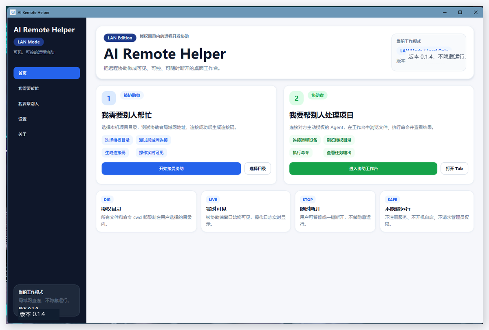
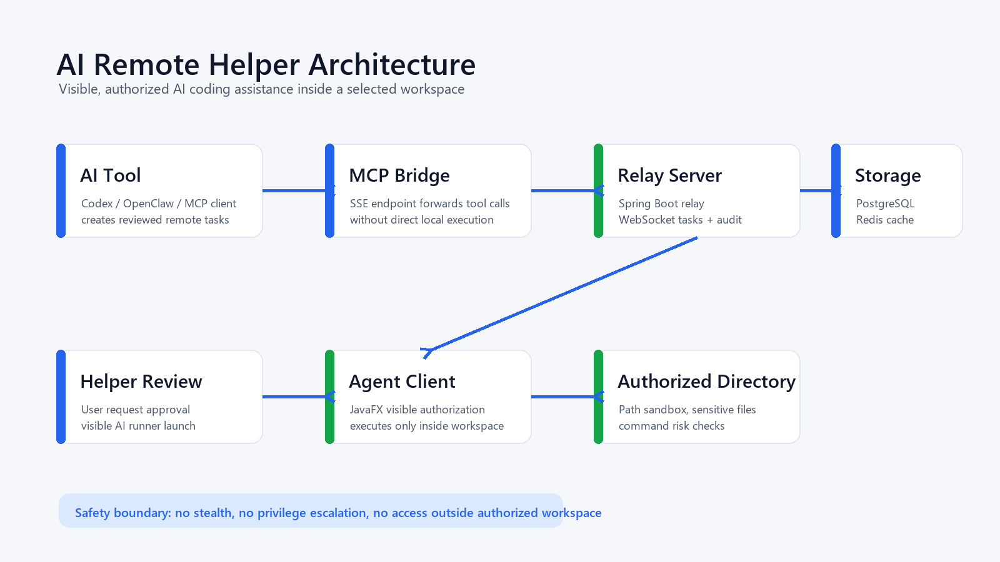
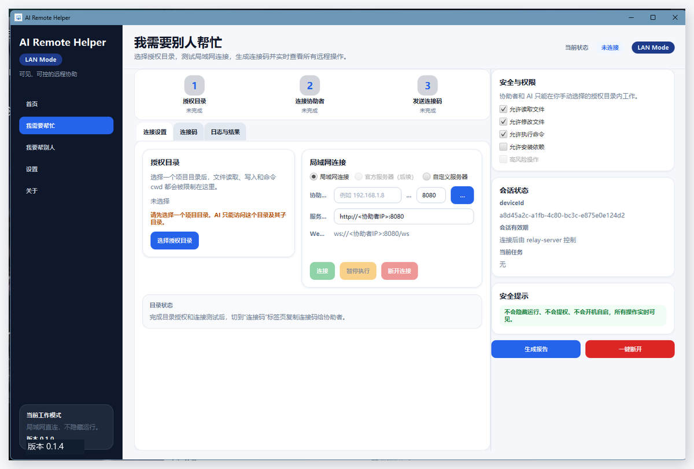
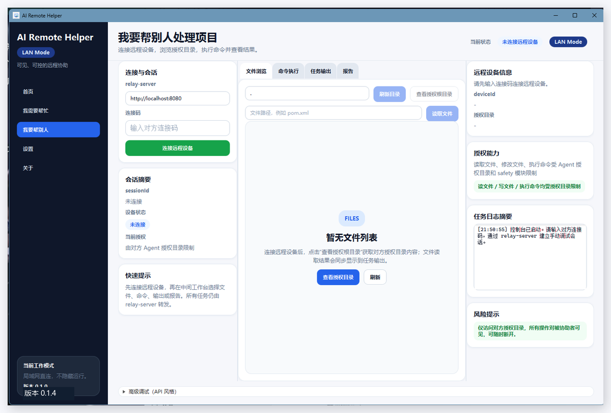

# AI Remote Helper

[English](README.md) | [下载最新版 Windows LAN 包](https://github.com/fanhualuoxianting/ai-remote-helper/releases/latest)

<p align="center">
  
</p>

AI Remote Helper 是一个面向 AI Coding 场景的“可见、授权式远程开发协助平台”。被协助方必须主动选择授权目录并保持桌面客户端可见；协助方或 AI 工具只能在这个授权目录内执行文件读取、写入、命令执行和日志查看。

它不是隐藏远控工具，不做静默运行、不开机自启、不提权、不接管鼠标键盘，也不会绕过授权目录。

## 项目亮点

- JavaFX 桌面客户端：用于被协助方授权目录、生成连接码、查看日志和随时断开。
- Spring Boot Relay Server：负责会话、WebSocket 任务转发、任务状态、日志和审计记录。
- MCP Bridge：为 OpenClaw 等 AI 工具提供标准 MCP/SSE 接入入口。
- 安全沙箱：限制路径穿越、敏感文件、危险命令和越权目录访问。
- AI 协助流程：被协助方提交自然语言需求，协助方审核后启动可见 Codex/OpenClaw 会话。
- Windows LAN 打包：提供可分发的 Windows app-image zip 包。

## 架构图

<p align="center">
  
</p>

| 模块 | 作用 |
| --- | --- |
| `agent-client` | JavaFX 桌面端，负责授权、连接、任务执行和日志展示。 |
| `relay-server` | Spring Boot 中继服务，负责在线设备、会话、任务、审计和 WebSocket 路由。 |
| `mcp-bridge` | MCP 协议桥接层，让 AI 工具通过 relay 操作远程授权目录。 |
| `common-protocol` | 共享 DTO、枚举和消息协议。 |
| `common-safety` | 路径沙箱、敏感文件保护和命令风险检测。 |
| `web-console` | Vue Web Console 原型，用于后续设备、日志、审计展示。 |

## 桌面工作流

| 被协助方客户端 | 协助方工作台 |
| --- | --- |
|  |  |

## 3 分钟本地演示

```powershell
git clone https://github.com/fanhualuoxianting/ai-remote-helper.git
cd ai-remote-helper

docker compose up -d
mvn clean package
scripts\start-relay-lan.bat
mvn -f agent-client/pom.xml javafx:run
```

演示流程：

1. 被协助方选择一个项目目录作为授权工作区。
2. 协助方输入连接码并连接远程会话。
3. 被协助方提交自然语言需求。
4. 协助方审核需求并批准。
5. Codex 或 OpenClaw 生成 JSON 任务。
6. Agent 只在授权目录内执行读文件、写文件或命令。
7. 日志、结果和报告回传到可见界面。

## 基本使用

被协助方：

1. 启动客户端。
2. 选择 `我需要别人帮忙`。
3. 选择授权项目目录。
4. 输入协助方的局域网 IP 和 relay 端口。
5. 测试连接并生成连接码。
6. 可选：在 `提交需求` 中描述要解决的问题。
7. 全程观察日志和结果，必要时随时断开。

协助方：

1. 启动 relay，Windows LAN 演示推荐：

```powershell
scripts\start-relay-lan.bat
```

2. 启动客户端并选择 `我要帮别人处理项目`。
3. 输入对方连接码。
4. 点击 `一键链路自检`，确认目录读取、任务下发和结果回传正常。
5. 在 `需求审核` 中批准需求，启动可见 AI Runner。
6. 在 `AI 协助` 中执行 AI 写入队列的下一条任务。

## 安全边界

AI Remote Helper 明确不实现以下能力：

- 不隐藏客户端窗口。
- 不开机自启。
- 不安装系统服务。
- 不默认请求管理员权限。
- 不绕过授权目录。
- 不接管鼠标或键盘。
- 不关闭防火墙或安全软件。
- 不读取浏览器数据、SSH 私钥或系统凭据。

更多安全说明见 [SECURITY.md](SECURITY.md)。

## Windows LAN 打包

```powershell
agent-client\scripts\package-lan-windows.bat -Offline
```

生成目录：

```text
dist/AI-Remote-Helper-LAN/
```

发布 zip 不提交到 Git，推荐上传到 GitHub Release。

## 常见问题

- 连接不上：确认两台电脑在同一局域网，并检查协助方 Windows 防火墙是否放行 relay 端口。
- 任务一直运行：`v0.1.4` 起 relay 会自动把超时任务标记为 `TIMEOUT`。
- 对方掉线：协助方界面会显示远程设备离线，需要对方重新连接并提供新连接码。
- 中文乱码：Windows 默认按 GBK 解码命令输出；如远端程序输出 UTF-8，可设置：

```powershell
$env:AIRH_COMMAND_OUTPUT_CHARSET='UTF-8'
```

## 当前版本

最新公开版本：`v0.1.4`

Release 下载：[https://github.com/fanhualuoxianting/ai-remote-helper/releases/latest](https://github.com/fanhualuoxianting/ai-remote-helper/releases/latest)

## 许可证

MIT。见 [LICENSE](LICENSE)。
